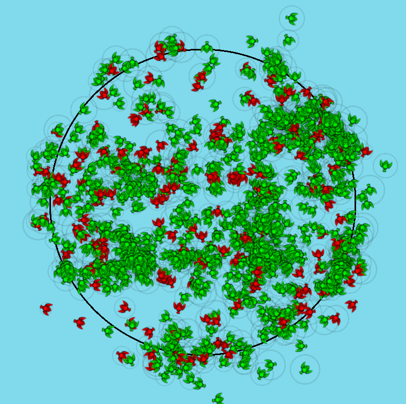

# Bois
Simple swarm simulation using the [Boids model](https://en.wikipedia.org/wiki/Boids)

Bois follow simple rules:  
- Separation: Don't bump into other bois
- Alignment: Follow your fellow nearbois
- Cohesion: Keep the gang together
- Escape: Don't go running out of the arena

Each Boi is has randomly generated attributes within some constraints:
- Vision: How far can they see
- Speed: How fast they can go
- Turning speed: How quickly can the turn around
- They also care about each of the rules above differently

# Roadmap
### Features
- Different Boi types - eg. predator & prey, different species with distinct strategies
- Lifecycles - death & breeding
- World interaction - Eg. different biomes, weather, mountains that affect the Bois differently.

### Technical improvements
- Graphics - Some terrain, ~sprites~, etc.
- Better data structure / algo for dealing with spatial stuff - STRTree for finding nearbois, etc.
- Interface to enable Bois as a simulation environment for others [Like these](https://github.com/clvrai/awesome-rl-envs)
- start refactoring out things - ~Entity~, ~Strategy~, ~separate update logic from rendering~, etc.
- Replace hand-rolled Vec2 with out of the box one from ggez.
